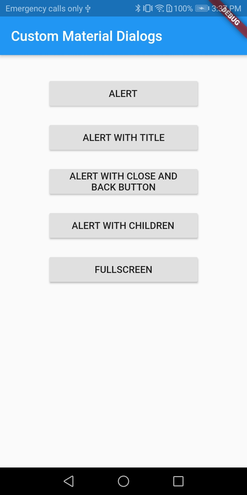
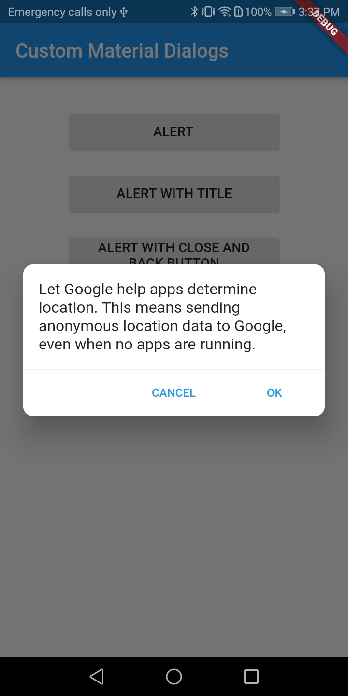
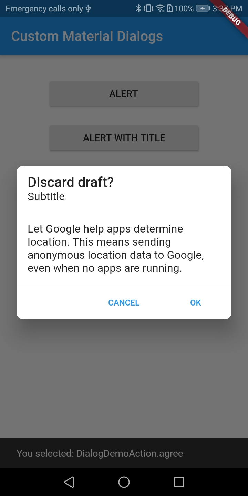
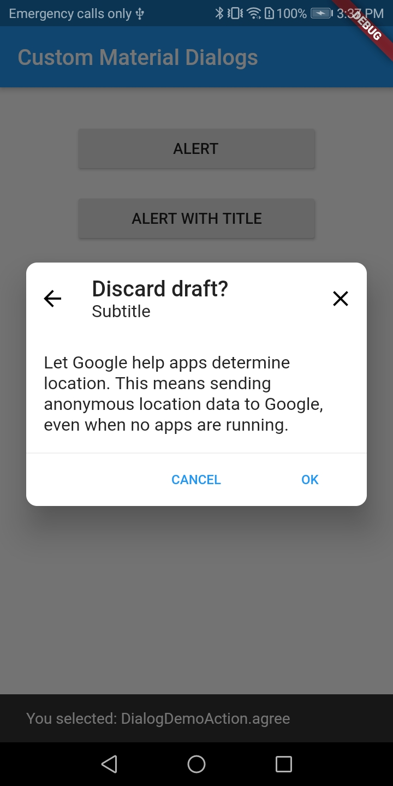
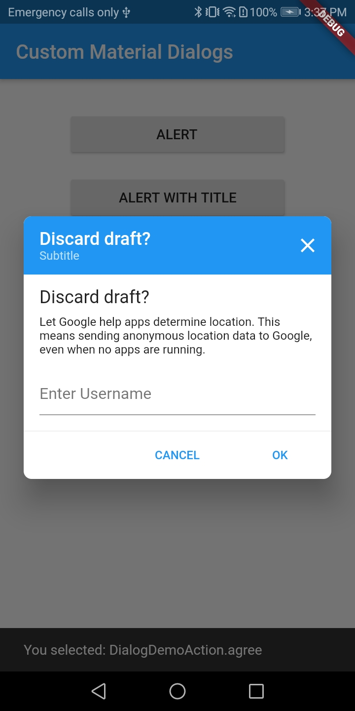

# material_dialog

A wrapper on top of alert dialog provided by flutter.

## Demo

<p>
  
  
  
  
  
</p>

Use this package as a library
-----------------------------

**1. Depend on it**

Add this to your package's pubspec.yaml file:

```
dependencies:
  material_dialog: ^0.0.x
```

**2. Install it**

You can install packages from the command line:

with Flutter

```
$ flutter packages get
```

Alternatively, your editor might support flutter packages get. Check the docs for your editor to learn more.

**3. Import it**

Now in your Dart code, you can use:

```
import 'package:material_dialog/material_dialog.dart';
```

How to use
----------

Using Material Dialog is quite easy, all you need to do is 

```dart
MaterialDialog(
  content: Text(_alertText),
  actions: <Widget>[
    FlatButton(
      child: Text(
        'CANCEL',
        style: Theme.of(context).textTheme.button.copyWith(
            fontSize: 12.0, color: Theme.of(context).primaryColor),
      ),
      onPressed: () {
        Navigator.pop(context, DialogDemoAction.agree);
      },
    ),
    FlatButton(
      child: Text(
        'OK',
        style: Theme.of(context).textTheme.button.copyWith(
            fontSize: 12.0, color: Theme.of(context).primaryColor),
      ),
      onPressed: () {
        Navigator.pop(context, DialogDemoAction.cancel);
      },
    ),
  ],
);
```

Use below method to show dialog

```dart
  void showDemoDialog<T>({BuildContext context, Widget child}) {
    showDialog<T>(
      context: context,
      builder: (BuildContext context) => child,
    ).then<void>((T value) {
      // The value passed to Navigator.pop() or null.
      if (value != null) {
        _scaffoldKey.currentState.showSnackBar(SnackBar(
          content: Text('You selected: $value'),
        ));
      }
    });
  }
```

## Simple Alert Dialog
```dart
Widget _buildAlertDialog(ThemeData theme, BuildContext context) {
return MaterialDialog(
  content: Text(_alertText),
  actions: <Widget>[
    FlatButton(
      child: Text(
        'CANCEL',
        style: Theme.of(context).textTheme.button.copyWith(
            fontSize: 12.0, color: Theme.of(context).primaryColor),
      ),
      onPressed: () {
        Navigator.pop(context, DialogDemoAction.agree);
      },
    ),
    FlatButton(
      child: Text(
        'OK',
        style: Theme.of(context).textTheme.button.copyWith(
            fontSize: 12.0, color: Theme.of(context).primaryColor),
      ),
      onPressed: () {
        Navigator.pop(context, DialogDemoAction.cancel);
      },
    ),
  ],
);
}
```

## Alert Dialog With Title
```dart
Widget _buildAlertDialogWithTitle(ThemeData theme, BuildContext context) {
return MaterialDialog(
  title: Text(_alertTitle),
  subTitle: Text('Subtitle'),
  content: Text(_alertText),
  actions: <Widget>[
    FlatButton(
      child: Text(
        'CANCEL',
        style: Theme.of(context).textTheme.button.copyWith(
            fontSize: 12.0, color: Theme.of(context).primaryColor),
      ),
      onPressed: () {
        Navigator.pop(context, DialogDemoAction.agree);
      },
    ),
    FlatButton(
      child: Text(
        'OK',
        style: Theme.of(context).textTheme.button.copyWith(
            fontSize: 12.0, color: Theme.of(context).primaryColor),
      ),
      onPressed: () {
        Navigator.pop(context, DialogDemoAction.cancel);
      },
    ),
  ],
);
}
```

## Alert Dialog With Close & Back Button
```dart
Widget _buildAlertDialogWithCloseAndBackButton(
  ThemeData theme, BuildContext context) {
return MaterialDialog(
  title: Text(_alertTitle),
  subTitle: Text('Subtitle'),
  content: Text(_alertText),
  enableBackButton: true,
  enableCloseButton: true,
  onBackButtonClicked: () {
    Navigator.pop(context, DialogDemoAction.agree);
  },
  onCloseButtonClicked: () {
    Navigator.pop(context, DialogDemoAction.cancel);
  },
  actions: <Widget>[
    FlatButton(
      child: Text(
        'CANCEL',
        style: Theme.of(context).textTheme.button.copyWith(
            fontSize: 12.0, color: Theme.of(context).primaryColor),
      ),
      onPressed: () {
        Navigator.pop(context, DialogDemoAction.agree);
      },
    ),
    FlatButton(
      child: Text(
        'OK',
        style: Theme.of(context).textTheme.button.copyWith(
            fontSize: 12.0, color: Theme.of(context).primaryColor),
      ),
      onPressed: () {
        Navigator.pop(context, DialogDemoAction.cancel);
      },
    ),
  ],
);
}
```

## Alert Dialog With Children
```dart
Widget _buildAlertDialogWithChildren(
  ThemeData theme, BuildContext context, bool isFullScreen) {
return MaterialDialog(
  borderRadius: 8.0,
  enableFullHeight: isFullScreen,
  enableFullWidth: isFullScreen,
  enableCloseButton: true,
  closeButtonColor: Colors.white,
  headerColor: Theme.of(context).primaryColor,
  title: Text(
    _alertTitle,
    style: TextStyle(
      color: Colors.white,
      fontSize: 18.0,
    ),
  ),
  subTitle: Text(
    'Subtitle',
    style: TextStyle(
      color: Colors.white70,
      fontSize: 12.0,
    ),
  ),
  onCloseButtonClicked: () {
    Navigator.pop(context, DialogDemoAction.cancel.toString());
  },
  children: <Widget>[
    Text(
      _alertTitle,
      style: TextStyle(
        fontSize: 18.0,
      ),
    ),
    SizedBox(height: 8.0),
    Text(
      _alertText,
      style: TextStyle(
        fontSize: 12.0,
      ),
    ),
    SizedBox(height: 16.0),
    TextField(
      decoration: InputDecoration(hintText: 'Enter Username'),
    ),
  ],
  actions: <Widget>[
    FlatButton(
      child: Text(
        'CANCEL',
        style: Theme.of(context).textTheme.button.copyWith(
            fontSize: 12.0, color: Theme.of(context).primaryColor),
      ),
      onPressed: () {
        Navigator.pop(context, DialogDemoAction.cancel.toString());
      },
    ),
    FlatButton(
      child: Text(
        'OK',
        style: Theme.of(context).textTheme.button.copyWith(
            fontSize: 12.0, color: Theme.of(context).primaryColor),
      ),
      onPressed: () {
        Navigator.pop(context, DialogDemoAction.agree.toString());
      },
    )
  ],
);
}
```

List of params
--------------

| Property              | Type         | Default Value | Description                                                                                                                                       |
|-----------------------|--------------|---------------|---------------------------------------------------------------------------------------------------------------------------------------------------|
| title                 | Widget       | null          | The (optional) title of the dialog is displayed in a large font at the top of the dialog.                                                         |
| subTitle              | Widget       | null          | The (optional) subtitle of the dialog is displayed below title of the dialog.                                                                     |
| content               | Widget       | null          | The (optional) content of the dialog is displayed in the center of the dialog in a lighter font.                                                  |
| actions               | List<Widget> | null          | The (optional) set of actions that are displayed at the bottom of the dialog.                                                                     |
| children              | List<Widget> | null          | The (optional) content of the dialog is displayed in a [SingleChildScrollView] underneath the title.                                              |
| headerColor           | Color        | null          | The (optional) header color is displayed in the header background.                                                                                |
| backButtonColor       | Color        | Colors.white  | The (optional) back button color. By default its set to white.                                                                                    |
| closeButtonColor      | Color        | Colors.white  | The (optional) close button color. By default its set to white.                                                                                   |
| onBackButtonClicked   | VoidCallback | null          | A callback function to get back button event from dialog. If back button is enabled this callback has to be provided in-order to get callbacks.   |
| onCloseButtonClicked  | VoidCallback | null          | A callback function to get close button event from dialog. If close button is enabled this callback has to be provided in-order to get callbacks. |
| enableBackButton      | bool         | false         | The (optional) value to enable/disable back button for a dialog.                                                                                  |
| enableCloseButton     | bool         | false         | The (optional) value to enable/disable close button for a dialog.                                                                                  |
| enableFullWidth       | bool         | true          | The (optional) value to stretch dialog to its max width.                                                                                          |
| enableFullHeight      | bool         | false         | The (optional) value to stretch dialog to its max height.                                                                                         |
| borderRadius          | double       | 10.0          | The (optional) border radius of a dialog. by default its 10.0.                                                                                    |
   
Thanks
------
If you liked my work, don’t forget to ⭐ star the repo to show your support.
                  